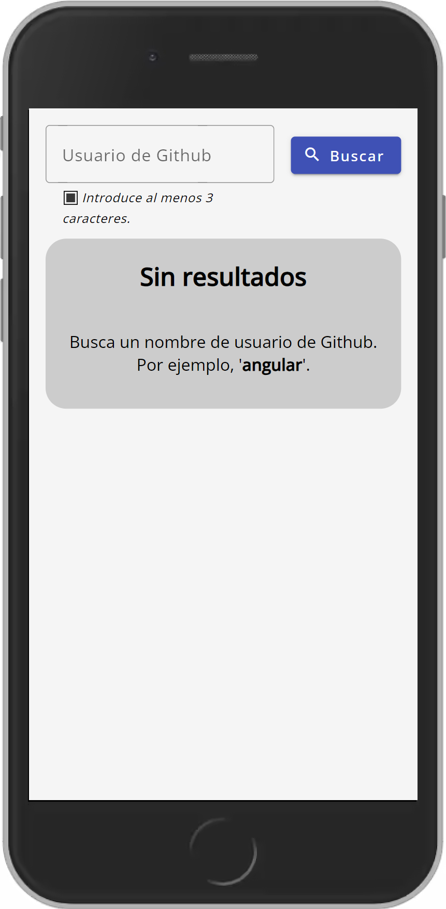
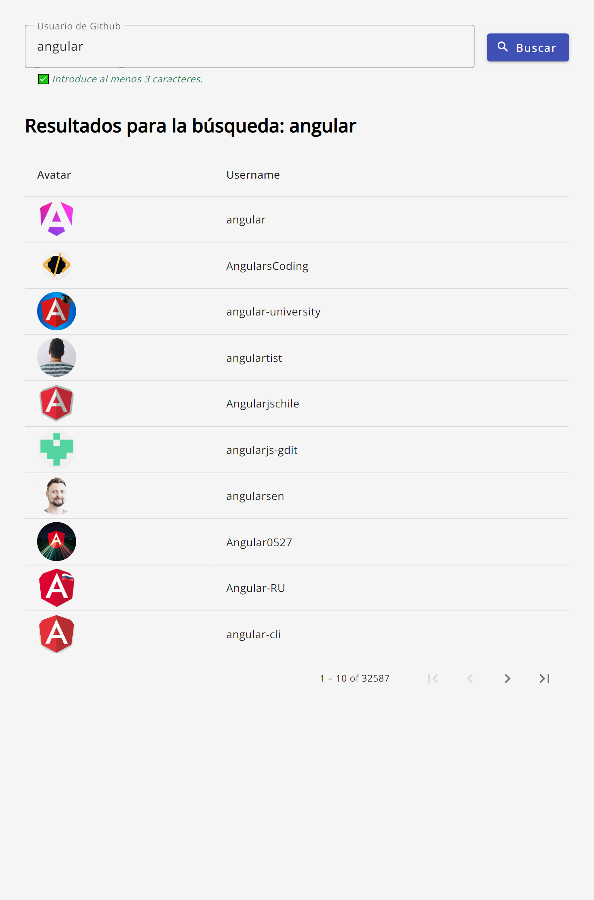

# Github Searcher

## Instalación

1. Instalar las dependencias con `npm install`.
2. (Opcional) Crear un archivo `.env` siguiendo el de ejemplo [.env.example](/.env.example) y rellenar las variables.
3. Lanzar con `ng serve --open`.

## Estructura

La aplicación se ha creado con la siguiente estructura:

```
├───app
│   ├───core
│   │   ├───interceptors
│   │   ├───services
│   │   ├───guards
│   │   ├───types
│   │   └───utils
│   ├───features
│   │   ├───home
│   │   │   ├───components
│   │   │   ├───services
│   │   │   ├───types
│   ├───shared
│   │   ├───components
│   │   ├───directives
│   │   ├───pipes
│   │   └───types
└───assets
```

* **core**: se incluirán bajo este directorio todos los elementos que se utilizarán en toda la aplicación (generalmente como Singleton), como los servicios, interceptors, guards, etc.
* **features**: se listarán bajo este directorio todas las funcionalidades, generalmente con ruta propia. Cada funcionalidad tendrá su propio directorio con los componentes, servicios, guards, etc. que sean necesarios. (Anteriormente cada una de estas features tendría su propio módulo con lazy-loading)
* **shared**: se incluirán bajo este directorio todos los elementos reutilizables a través de la aplicación. En el futuro mucha de esta funcionalidad se podrá mover a librerías de Angular.

### Mejoras

1. TODO: Crear carrousel para mostrar usuarios. (Añadir toogle para cambiar entre la vista de tabla y la de carrousel).
2. TODO: Añadir pantalla con ruta al perfil del usuario, donde muestre sus datos como por ejemplo, un gráfico de barras con el número de seguidores de cada usuario (ChartJS).
3. Incluir componente para mostrar mensajes de error (toast - banner - dialog) lanzado desde un interceptor global ErrorHandler.
4. Unit & Integration testing.

## Capturas

### Mobile

* iPhone 8 sin resultados (pre-búsqueda)
{: style="width: 300px; margin: 10px;"}
* iPhone 8 con resultados
{: style="width: 300px; margin: 10px;"}
* iPhone 8 sin resultados coincidentes (post-búsqueda)
{: style="width: 300px; margin: 10px;"}

### Tablet

* Tablet con resultados
{: style="width: 500px; margin: 10px;"}

### Desktop

* Desktop con resultados
{: style="width: 800px; margin: 10px;"}

## Troubleshooting

> [!CAUTION]
> La API de Github solo permite los primeros 1.000 resultados, por lo tanto si páginas más allá de la página 100, a 10 resultados por cada página (10 * 100 = 1.000 resultados) llegas al límite y la API devuelve un error.

> [!NOTE]
> La API de GitHub es pública y permite hacer peticiones sin autenticación, pero tiene un límite de peticiones temporal por IP, por lo que si se supera el límite, la API devuelve un error.
